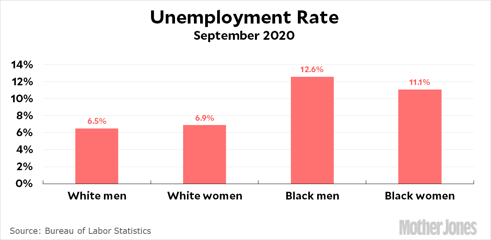

```{r setup, include=FALSE}
library(flexdashboard)
library(usethis)
library(here)
library(dplyr)
library(noraproj2)
library(ggplot2)
library(tidyr)
library(tidytuesdayR)
library(readr)
library(shiny)
```

# About

## Column {data-width=650}

**Purpose**
The purpose of this dashboard is to bring awareness to unemployment rate differences by gender.

**Original Source**

This dataset was analyzed for project 2 of this course. Found in the [Tidy Tuesday GitHub repository](https://github.com/rfordatascience/tidytuesday), this data set comes from [the National Database of Childcare Prices](https://www.dol.gov/agencies/wb/topics/featured-childcare). For more information on this data set, reference the linked article [here](https://www.dol.gov/sites/dolgov/files/WB/NDCP/508_WB_IssueBrief-NDCP-20230213.pdf)

### Figure
This figure shows prior research which made me interested in the project and motivated my topic choice.

The figure link and source is from an article I read [here](https://www.motherjones.com/kevin-drum/2020/10/black-white-men-women-a-deeper-look-at-the-employment-numbers/)

<figure>
  
</figure>


## Column{.tabset}
-------------------------

# The Data

## Column{.tabset .tab-fade}

### Loading the Data

```{r,message=FALSE, echo=TRUE}
if (!dir.exists(here("data"))) {
  dir.create(here("data"))
}
childcare_costs_data <- here("data", "childcare_costs.csv")

childcare_costs <- readr::read_csv('https://raw.githubusercontent.com/rfordatascience/tidytuesday/master/data/2023/2023-05-09/childcare_costs.csv', show_col_types = FALSE)
readr::write_csv(childcare_costs, childcare_costs_data)
```


### Data (variables) Summary Table

```{r}
summary(childcare_costs)
```


# Interactive Data Dictionary

**Data Dictionary**

The data dictionary for `childcare_costs.csv`[here](https://github.com/rfordatascience/tidytuesday/blob/master/data/2023/2023-05-09/readme.md).

These are the specific variables I use in my analysis.

```{r}
data_dict<- data.frame(variable_name = c("county_fips_code", "funr_16", "munr_16", "memp_m", "femp_m", "memp_service", "femp_service", "memp_sales", "femp_sales", "memp_n", "femp_n", "memp_p", "femp_p"), value = c("	Four- or five-digit number that uniquely identifies the county in a state. The first two digits (for five-digit numbers) or 1 digit (for four-digit numbers) refer to the FIPS code of the state to which the county belongs.", "Unemployment rate of the female population aged 16 years old or older.", "Unemployment rate of the male population aged 16 years old or older.", "Percent of male civilians employed in management, business, science, and arts occupations aged 16 years old or older in the county.", "Percent of female civilians employed in management, business, science, and arts occupations aged 16 years old or older in the county.", "Percent of male civilians employed in service occupations aged 16 years old and older in the county.", "Percent of female civilians employed in service occupations aged 16 years old and older in the county.", "Percent of male civilians employed in sales and office occupations aged 16 years old and older in the county.", "Percent of female civilians employed in sales and office occupations aged 16 years old and older in the county.", "Percent of male civilians employed in natural resources, construction, and maintenance occupations aged 16 years old and older in the county.", "Percent of female civilians employed in natural resources, construction, and maintenance occupations aged 16 years old and older in the county.", "Percent of male civilians employed in production, transportation, and material moving occupations aged 16 years old and older in the county.", "Percent of female civilians employed in production, transportation, and material moving occupations aged 16 years old and older in the county."))

data_dict %>% DT::datatable()
```


# Data Analysis

## Column{.tabset .tab-fade}

### Questions

Question 1: How do overall unemployment rates for individuals 16 or older vary by gender?

Question 2: How does this unemployment by gender vary by region?

Question 3: Do certain employment types for individuals 16 and older have higher percentages employed of males compared to females?

### Code

#### Question 1

```{r, echo=TRUE}

childcare_costs <- na.omit(childcare_costs)
plot1<- childcare_costs %>% select(funr_16, munr_16) %>%
  pivot_longer(cols = c(munr_16, funr_16), names_to = "gender", values_to = "unemployment_rate") %>%
  mutate(gender = ifelse(gender == "munr_16", "Male", "Female")) %>% #all munr_16 is male, else is female
  ggplot(aes(x = gender, y = unemployment_rate, fill = gender)) +
  geom_boxplot() + 
  labs(title = "Unemployment Rate for Males and Females 16 and Older",
       subtitle = "Male seem to have higher unemployment rates compared to females",
       x = "Gender",
       y = "Unemployment Rate",
       caption = "Source: National Database of Childcare Prices") +
  theme_minimal()

```

#### Question 2
```{r, echo=TRUE,results='hide'}
# Part 1
plot2<-childcare_costs %>%
  select(county_fips_code, munr_16, funr_16) %>%
  group_by(county_fips_code) %>%
  summarize(male = mean(munr_16),
            female = mean(funr_16)) %>% 
  ggplot(aes(x = county_fips_code)) +
  geom_bar(aes(y = male, fill = "Male"), position = "dodge", stat = "identity") +
  geom_bar(aes(y = female, fill = "Female"), position = "dodge", stat = "identity") +
  labs(title = "Gender Unemployment Rates by County Codes",
       subtitle = "There is a clear difference in unemployment rates for sex depending on county ",
       x = "County Code",
       y = "Mean unemployment Rate",
       caption = "Source: National Database of Childcare Prices") +
  scale_fill_manual(values = c("Male" = "blue", "Female" = "pink"))

# Part 2
calculate_CI <- function(data) {
  result <- t.test(data)
  return(c(result$conf.int[1], result$conf.int[2]))
}
# Counties with lowest unemployment rate for males
childcare_costs_male_low <- childcare_costs %>%
  select(county_fips_code, munr_16, funr_16) %>%
  filter(munr_16 < 1)
cat("Counties with lowest unemployment rates for males have rates of:", calculate_CI(childcare_costs_male_low$munr_16))

# Counties with lowest unemployment rate for females
childcare_costs_female_low <- childcare_costs %>%
  select(county_fips_code, munr_16, funr_16) %>%
  filter(funr_16 < 1)
cat("Counties with lowest unemployment rates for females have rates of:", calculate_CI(childcare_costs_female_low$munr_16))

# Counties with highest unemployment rates for males
childcare_costs_male_high <- childcare_costs %>%
  select(county_fips_code, munr_16, funr_16) %>%
  filter(munr_16 > 20)
cat("Counties with highest unemployment rates for males have rates of:", calculate_CI(childcare_costs_male_high$munr_16))

# Counties with highest unemployment rates for females
childcare_costs_female_high <- childcare_costs %>%
  select(county_fips_code, munr_16, funr_16) %>%
  filter(funr_16 > 18)
cat("Counties with highest unemployment rates for females have rates of:", calculate_CI(childcare_costs_female_high$funr_16))
```

#### Question 3

```{r, echo=TRUE, results='hide'}
# Sorry for the long renaming, but I did this so I can easily split (using separate) gender and job type later to get the table I wanted before using ggplot
childcare_costs %>%
  rename(m_manager = memp_m,f_manager = femp_m,m_service = memp_service,f_service = femp_service,m_sales = memp_sales,f_sales = femp_sales,m_natresource = memp_n,f_natresource = femp_n,m_production = memp_p,f_production = femp_p) %>%
  select(m_manager, f_manager, m_service, f_service, m_sales, f_sales, m_natresource, f_natresource, m_production, f_production) %>%
  summarise(across(everything(), ~mean(., na.rm = TRUE))) %>% #so I don't have to write out mean for each one
  pivot_longer(cols = everything(), names_to = "job_type", values_to = "mean") %>%
  separate(job_type, into = c("gender", "job"), sep = "_") %>% #categorize so the job type and gender is sep cols so that I can get a graph with both genders separated by job type
  ggplot(aes(x = job, y = mean, color = gender)) +
  geom_point(position = position_dodge(width = 0.8), size = 3) +
  facet_grid(~job) +
  labs(title = "Mean Employment Percent by Gender for Each Job Type",
       subtitle = "Male and female employment percent seems to fluctuate by employment type",
       x = "Job Type",
       y = "Mean Employment Percent",
       caption = "Source: National Database of Childcare Prices") +
  scale_color_manual(values = c("blue", "pink"), labels = c("Male", "Female"))+
  theme(axis.text.x = element_blank()) #I purposefully wanted to remove this bc it is cluttery and facet labels already does this anyways
```


# Male vs Female Unemployment (16+)
## Column{.tabset .tab-fade}

```{r}
childcare_costs <- na.omit(childcare_costs)
childcare_costs %>% select(funr_16, munr_16) %>%
  pivot_longer(cols = c(munr_16, funr_16), names_to = "gender", values_to = "unemployment_rate") %>%
  mutate(gender = ifelse(gender == "munr_16", "Male", "Female")) %>% #all munr_16 is male, else is female
  ggplot(aes(x = gender, y = unemployment_rate, fill = gender)) +
  geom_boxplot() + 
  labs(title = "Unemployment Rate for Males and Females 16 and Older",
       subtitle = "Male seem to have higher unemployment rates compared to females",
       x = "Gender",
       y = "Unemployment Rate",
       caption = "Source: National Database of Childcare Prices") +
  theme_minimal()
```


# Unemployment by County (Visual)

## Column{.tabset .tab-fade}

### Part 1

```{r}
childcare_costs %>%
  select(county_fips_code, munr_16, funr_16) %>%
  group_by(county_fips_code) %>%
  summarize(male = mean(munr_16),
            female = mean(funr_16)) %>% 
  ggplot(aes(x = county_fips_code)) +
  geom_bar(aes(y = male, fill = "Male"), position = "dodge", stat = "identity") +
  geom_bar(aes(y = female, fill = "Female"), position = "dodge", stat = "identity") +
  labs(title = "Gender Unemployment Rates by County Codes",
       subtitle = "There is a clear difference in unemployment rates for sex depending on county ",
       x = "County Code",
       y = "Mean unemployment Rate",
       caption = "Source: National Database of Childcare Prices") +
  scale_fill_manual(values = c("Male" = "blue", "Female" = "pink"))
```


### Assessment Q2 Part 1 to Part 2

While we see a helpful visual, it is clear that for some counties males have much higher unemployment rates and in other counties females do. To get a more exact and quantitative understanding, for part 2 I am going to apply my calculate_CI function to get a 95% confidence interval for only the counties that have the highest and lowest of mean.


### Part 2 (Quantitative Analysis)
```{r}
calculate_CI <- function(data) {
  result <- t.test(data)
  return(c(result$conf.int[1], result$conf.int[2]))
}
# Counties with lowest unemployment rate for males
childcare_costs_male_low <- childcare_costs %>%
  select(county_fips_code, munr_16, funr_16) %>%
  filter(munr_16 < 1)
cat("Counties with lowest unemployment rates for males have rates of:", calculate_CI(childcare_costs_male_low$munr_16))

# Counties with lowest unemployment rate for females
childcare_costs_female_low <- childcare_costs %>%
  select(county_fips_code, munr_16, funr_16) %>%
  filter(funr_16 < 1)
cat("Counties with lowest unemployment rates for females have rates of:", calculate_CI(childcare_costs_female_low$munr_16))

# Counties with highest unemployment rates for males
childcare_costs_male_high <- childcare_costs %>%
  select(county_fips_code, munr_16, funr_16) %>%
  filter(munr_16 > 20)
cat("Counties with highest unemployment rates for males have rates of:", calculate_CI(childcare_costs_male_high$munr_16))

# Counties with highest unemployment rates for females
childcare_costs_female_high <- childcare_costs %>%
  select(county_fips_code, munr_16, funr_16) %>%
  filter(funr_16 > 18)
cat("Counties with highest unemployment rates for females have rates of:", calculate_CI(childcare_costs_female_high$funr_16))
```


From the quantitative results of Question 2 that assessed the CI's, among the lowest counties for females, the average unemployment for females is higher compared to the unemployment for males when looking at the lowest unemployment counties for males. Among the highest unemployment counties for females, the unemployment for females is lower than the when looking at counties with the highest unemployment rate for males. This somewhat makes sense with the data as the overall average unemployment rates seem to be very close (from the boxplot Q1). However, there may be other factors that need to be investigated to truly understand this.


# Employment by Job Type (M vs F)
## Column{.tabset .tab-fade}

```{r}
# Sorry for the long renaming, but I did this so I can easily split (using separate) gender and job type later to get the table I wanted before using ggplot
childcare_costs %>%
  rename(m_manager = memp_m,f_manager = femp_m,m_service = memp_service,f_service = femp_service,m_sales = memp_sales,f_sales = femp_sales,m_natresource = memp_n,f_natresource = femp_n,m_production = memp_p,f_production = femp_p) %>%
  select(m_manager, f_manager, m_service, f_service, m_sales, f_sales, m_natresource, f_natresource, m_production, f_production) %>%
  summarise(across(everything(), ~mean(., na.rm = TRUE))) %>% #so I don't have to write out mean for each one
  pivot_longer(cols = everything(), names_to = "job_type", values_to = "mean") %>%
  separate(job_type, into = c("gender", "job"), sep = "_") %>% #categorize so the job type and gender is sep cols so that I can get a graph with both genders separated by job type
  ggplot(aes(x = job, y = mean, color = gender)) +
  geom_point(position = position_dodge(width = 0.8), size = 3) +
  facet_grid(~job) +
  labs(title = "Mean Employment Percent by Gender for Each Job Type",
       subtitle = "Male and female employment percent seems to fluctuate by employment type",
       x = "Job Type",
       y = "Mean Employment Percent",
       caption = "Source: National Database of Childcare Prices") +
  scale_color_manual(values = c("blue", "pink"), labels = c("Male", "Female"))+
  theme(axis.text.x = element_blank()) #I purposefully wanted to remove this bc it is cluttery and facet labels already does this anyways
```

# Interactive: Unemployment by County

## Column{.sidebar}

```{r}
selectInput("County", "County Code:", unique(childcare_costs$county_fips_code))
```
## Column
```{r}
renderPlot({
  selected_county <- input$County
  if (!is.null(selected_county)) {
    childcare_costs %>%
      filter(county_fips_code == selected_county) %>%
      pivot_longer(cols = c(munr_16, funr_16), names_to = "Gender", values_to = "Rate") %>% 
      ggplot(aes(x = Gender, y = Rate)) +
      geom_bar(stat = "identity", position = "dodge", width = 0.8) +
      labs(title = paste("Gender Unemployment Rates for County Code:", selected_county),
           x = "Gender",
           y = "Mean Unemployment Rate",
           caption = "Source: National Database of Childcare Prices") +
      theme_minimal()
  } else {
    ggplot() +
      ggtitle("Please select a County Code.")
  }
})

```
# Interactive: Unemployment by Year
```{r}
selectInput("Year", "Study Year:", unique(childcare_costs$study_year))
```
## Column
```{r}
renderPlot({
  selected_year <- input$Year
  if (!is.null(selected_year)) {
    childcare_costs %>%
      filter(study_year == selected_year) %>%
      pivot_longer(cols = c(munr_16, funr_16), names_to = "Gender", values_to = "Rate") %>% 
      ggplot(aes(x = Gender, y = Rate)) +
      geom_bar(stat = "identity", position = "dodge", width = 0.8) +
      labs(title = paste("Gender Unemployment Rates for Study Year:", selected_year),
           x = "Gender",
           y = "Mean Unemployment Rate",
           caption = "Source: National Database of Childcare Prices") +
      theme_minimal()
  } else {
    ggplot() +
      ggtitle("Please select a Year.")
  }
})

```

# Summary
## Column{.tabset .tab-fade}

Overall, the three research questions were assessed graphically and their findings are as follows. Unemployment rates tend to fluctuate based on gender and county, which leads to wanting to understand how certain factors such as economic status, race, etc. may be underlying and impacting these unemployment rates. In addition to this, I also investigated employment percentages for different types of jobs by gender. It seems that employment type percentages also fluctuate by certain positions. This leads me to think and consider looking further into if certain genders are more likely to pursue or attain certain roles, or if there are other outside factors, such as factors changing over the years (shown in the last graph) that is also influencing this.

# Video

<iframe src="https://player.vimeo.com/video/897488715" width="640" height="360" frameborder="0" allow="autoplay; fullscreen" allowfullscreen></iframe>